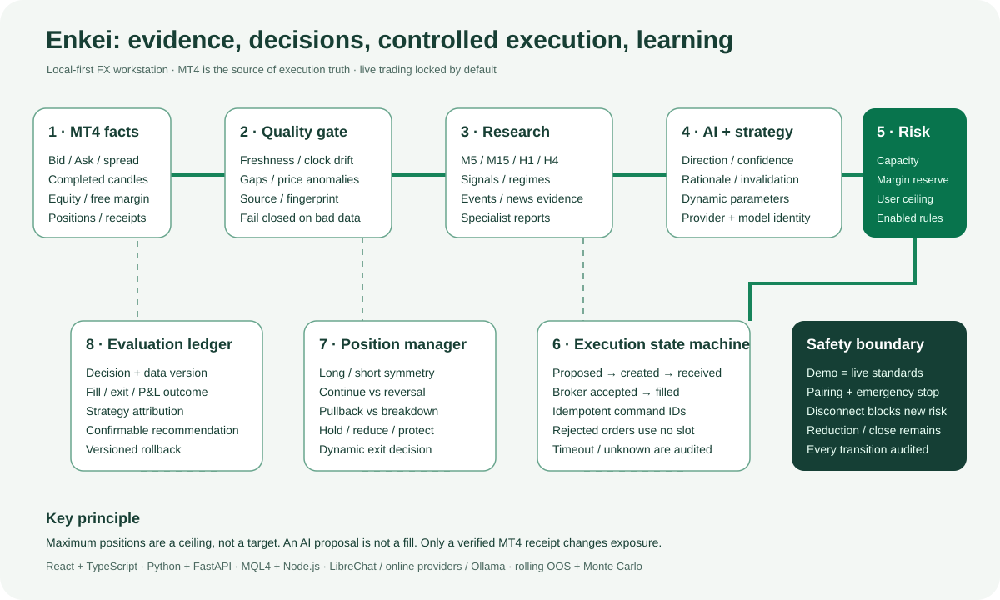
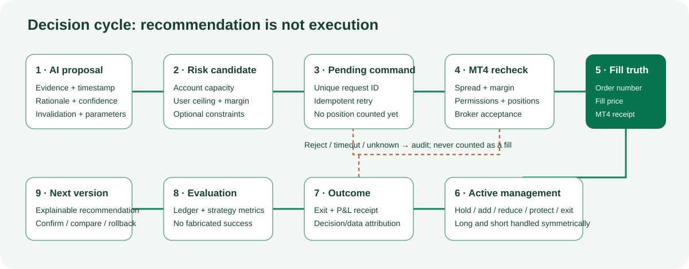

# Enkei FX

[日本語](./README.ja.md) | [English](./README.en.md) | [中文](./README.md)



Enkei is a local-first FX research, AI analysis, strategy validation, and controlled-execution workstation for Windows and MetaTrader 4. Quotes, audit records, and learning data stay on the user's computer by default. External traffic is limited to model services and news sources explicitly configured by the user.

> This is the first public beta. It is not investment advice and does not promise returns. Live trading is locked by default; complete Demo validation and understand every safeguard before enabling it.

## How it works

1. MT4 EAs publish real quotes, historical candles, account capacity, and execution receipts.
2. Enkei validates freshness, timestamps, gaps, and provenance. Invalid data cannot enter a trading decision.
3. Local strategies and AI analysis independently produce direction, confidence, and rationale; the complete session and data fingerprint are retained locally.
4. Demo and live modes use the same decision, risk, audit, and learning standards.
5. An order reaches MT4 only after the user ceiling, account capacity, spread, stop protection, and every enabled condition pass.
6. Real MT4 fills and exits enter the evaluation ledger, supporting explainable, confirmable, and reversible weight recommendations.

## Highlights

- Complete Japanese, English, and Chinese UI modes without mixed-language pages.
- MT4 quotes, history, Demo/live positions, and read-only account-capacity reporting.
- Unified AI sessions, verifiable model identity, research/news evidence, and token records.
- Fixed strategy library, holdout, rolling-window, Monte Carlo, and forward validation.
- Demo and controlled live automation; default position ceiling 2, user-editable within the hard limit.
- AI parameter guidance, user confirmation, versioning, comparison, and rollback.
- Event monitoring, abnormal-volatility research, 15-minute specialist tracking, and operations centre.
- Local pairing, emergency stop, disconnect protection, margin reserve, and execution audit.

## Core design

Enkei is not a script that gives an LLM unrestricted control of MT4. Research, decisions, constraints, execution, and evaluation are separated into independently verifiable layers:

- **Facts:** timestamped Bid/Ask, spread, completed candles, equity, free margin, positions, fills, and broker receipts.
- **Data quality:** freshness, clock drift, candle gaps, price anomalies, and content fingerprints. Unverifiable inputs force a wait/degraded result.
- **Research:** M5/M15/H1/H4 structure, technical features, scheduled events, news evidence, and specialist reports. News explains price; it never replaces price evidence.
- **Decision:** deterministic strategies and AI independently declare regime, direction, confidence, rationale, invalidation, and candidate parameters. The actual provider and model are retained.
- **Risk:** allowed exposure is calculated from real account capacity, the user's ceiling, margin reserve, and enabled constraints. Maximum positions are a ceiling—not a target.
- **Execution:** command creation, EA receipt, broker acceptance, and fill are distinct states. Capacity changes only after an MT4 receipt; rejected requests never consume a slot.
- **Position management:** long and short positions are symmetric. Trend continuation, reversal, pullback, and open profit inform hold, reduce, protect, or exit decisions instead of relying only on fixed TP/SL.
- **Evaluation:** outcomes are linked to the original data fingerprint and decision version, producing explainable, confirmable, and reversible recommendations.



## Technology map

| Area | Implementation and purpose |
|---|---|
| Workstation | React, TypeScript, Vinext/Vite; multilingual console, charts, operations, and settings |
| AI terminal | Python, FastAPI, Pydantic, HTTPX; routing, schema validation, research scheduling, and audit |
| MT4 bridge | MQL4 EAs plus a local Node.js service; bidirectional market, account, command, and receipt transport |
| Model routing | Online OpenAI-compatible providers, LibreChat Agents API, and local Ollama with explicit availability states |
| Validation | In/out-of-sample tests, rolling windows, seeded Monte Carlo, forward validation, and human promotion |
| Resilience | Background services independent of the browser, reconnects, idempotent commands, timeouts, circuit breakers, and disconnect protection |
| Security | Loopback binding, local configuration, live lock by default, emergency stop, least privilege, release allowlist, and secret scanning |

## Execution state semantics

An `AI recommendation` is not a `created command`, and a `created command` is not a `fill`. MT4 and broker receipts are the only execution truth:

1. AI returns a timestamped proposal with evidence and invalidation conditions.
2. The risk engine combines live account capacity with user-selected limits.
3. The local gateway creates a uniquely identified pending request.
4. The MT4 EA rechecks spread, margin, positions, and trading permission.
5. Only a real order number and fill receipt produce “executed” and consume capacity.
6. Rejections, timeouts, and unknown outcomes remain auditable and can never masquerade as fills.

## Quick installation

Requirements: 64-bit Windows 10/11 and MetaTrader 4. Setup attempts to configure Node.js 22.13+ and Python 3.11+ when missing. Local LibreChat also requires Docker Desktop.

1. Download the release archive and fully extract it to a short path such as `C:\Enkei`.
2. Run `Start-Enkei.cmd`; first launch installs dependencies and opens `http://127.0.0.1:3000`.
3. In MT4 choose File → Open Data Folder, then copy the three `.mq4` files from `bridge` to `MQL4\Experts`.
4. Press `F4`, compile each EA in MetaEditor, and confirm `0 errors, 0 warnings`.
5. Refresh MT4 Navigator. Attach the read-only quote EA first, then Demo or live execution EA only when required.
6. Complete connection, data calibration, and Demo validation. Live execution never enables itself.

See the [English user guide](./docs/guide.en.md) for model setup, upgrades, and troubleshooting.

## Model connections

- Online providers: select the provider and model in the AI terminal; store the API key through local environment/settings. Keys are never part of the repository.
- LibreChat: connect a local LibreChat Agents API. Ordinary web-chat history is never presented as an Enkei analysis session.
- Local models: install Ollama, pull a model, and select the local route.
- If no model is available, Enkei reports that state or explicitly falls back to local rules; it never fabricates an AI response.

## Safety boundary

- Services bind to loopback and should not be exposed directly to a LAN or the Internet.
- Live execution is locked by default and requires account confirmation, pairing, and manual EA authorization in MT4.
- Emergency stops never auto-reset. A disconnect blocks new risk while controlled risk reduction remains available.
- Secrets, accounts, logs, market history, training/learning data, databases, and internal work reports are not release source files.

## Development

```powershell
npm install
npm run ci
cd ai-terminal
.venv\Scripts\python.exe -B -m unittest discover -p "test_*.py"
```

Read [CONTRIBUTING.md](./CONTRIBUTING.md), [SECURITY.md](./SECURITY.md), and [third-party notices](./THIRD_PARTY_NOTICES.md). Licensed under the [MIT License](./LICENSE).
