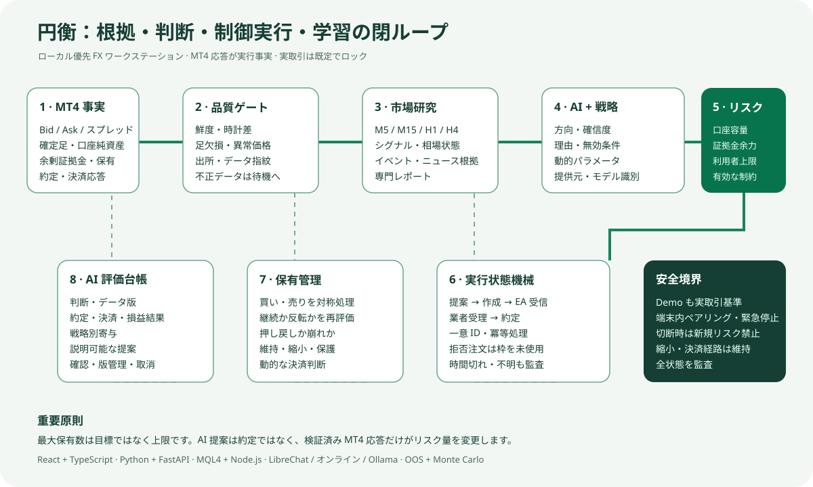

# 円衡 Enkei FX

[日本語](./README.ja.md) | [English](./README.en.md) | [中文](./README.md)



円衡は Windows と MetaTrader 4 向けのローカル優先 FX 研究・AI 分析・戦略検証・制御実行ワークステーションです。レート、監査記録、学習データは既定で利用者の PC 内に保存されます。外部通信は利用者が明示的に設定したモデルサービスとニュース取得先に限られます。

> 現在の版は最初の公開ベータです。投資助言ではなく、収益を保証しません。実取引は既定でロックされています。Demo 検証と安全機能の理解を終えてから有効化してください。

## 動作原理

1. MT4 EA が実レート、履歴足、口座余力、約定応答を公開します。
2. 円衡が鮮度、時刻、欠損、出所を検証し、不適格なデータを判断から除外します。
3. ローカル戦略と AI 分析が方向、確信度、理由を独立して提示し、完全なセッションとデータ指紋を端末内に保存します。
4. Demo と実取引は同じ判断、リスク、監査、学習基準を使います。
5. 利用者上限、口座余力、スプレッド、損切り保護、有効な全条件を通過した注文だけが MT4 に送られます。
6. MT4 の実約定と決済応答を評価台帳へ記録し、説明可能で確認・取消可能な重み提案に利用します。

## 主な機能

- 日本語、English、中文の完全な UI。選択画面内で言語を混在させません。
- MT4 レート、履歴、Demo/実取引ポジション、読取専用口座余力の取得。
- 統一 AI セッション、検証可能なモデル識別、研究・ニュース根拠、Token 記録。
- 固定戦略ライブラリ、ホールドアウト、ローリング窓、モンテカルロ、フォワード検証。
- Demo と制御された実取引自動運用。既定の最大保有数は 2、ハード上限内で利用者が変更可能。
- AI パラメータ提案、利用者確認、版管理、比較、ロールバック。
- 予定イベント監視、異常変動研究、15 分専門追跡、運用センター。
- 端末内ペアリング、緊急停止、切断保護、証拠金余力、実行監査。

## 中核設計

円衡は LLM に MT4 の無制限な操作権を渡すスクリプトではありません。研究、判断、制約、実行、評価を独立して検証できる層へ分離しています。

- **事実層**：時刻と出所を持つ Bid/Ask、スプレッド、確定足、純資産、余剰証拠金、保有、約定、ブローカー応答だけを扱います。
- **品質層**：鮮度、時計差、足の欠損、異常価格、データ指紋を検査します。確認不能な入力では待機または縮退になります。
- **研究層**：M5/M15/H1/H4 構造、技術特徴、予定イベント、ニュース根拠、専門レポートを統合します。ニュースは価格を説明しますが、価格証拠の代用にはなりません。
- **判断層**：固定戦略と AI が相場状態、方向、確信度、理由、無効条件、候補パラメータを独立して提示し、実際の提供元とモデル名を保存します。
- **リスク層**：実口座容量、利用者上限、証拠金バッファ、有効な制約から許容リスクを計算します。最大保有数は目標ではなく上限です。
- **実行層**：指令作成、EA 受信、ブローカー受理、約定を別状態として管理します。MT4 応答後だけ保有数へ加算し、拒否注文は枠を消費しません。
- **保有管理層**：買いと売りを対称に扱い、継続、反転、押し戻し、含み益から維持、縮小、保護、決済を判断します。固定 TP/SL の待機だけには依存しません。
- **評価層**：結果を当時のデータ指紋と判断版へ結び、説明可能で確認・取消可能な提案へ反映します。


## 技術構成

| 領域 | 実装と目的 |
|---|---|
| ワークステーション | React、TypeScript、Vinext/Vite。多言語コンソール、チャート、運用画面、設定 |
| AI 端末 | Python、FastAPI、Pydantic、HTTPX。経路選択、構造検証、研究スケジュール、監査 |
| MT4 ブリッジ | MQL4 EA とローカル Node.js サービス。市場・口座・指令・応答の双方向伝送 |
| モデル経路 | OpenAI 互換オンライン提供元、LibreChat Agents API、Ollama。利用不能状態を明示 |
| 検証 | サンプル内外、ローリング窓、固定シード Monte Carlo、フォワード検証、人工昇格 |
| 安定性 | ブラウザーから独立した常駐処理、再接続、冪等指令、タイムアウト、遮断、切断保護 |
| 安全・プライバシー | ループバック、ローカル設定、実取引の既定ロック、緊急停止、公開許可リスト、秘密情報検査 |

## 実行状態の意味

`AI 提案`、`指令作成`、`約定`は同じ意味ではありません。MT4 とブローカーの応答だけを実行事実として扱います。

1. AI が根拠、時刻、無効条件を持つ提案を返します。
2. リスクエンジンが実口座容量と利用者上限を合わせます。
3. ローカルゲートウェイが一意 ID の待機要求を作成します。
4. MT4 EA がスプレッド、証拠金、保有、取引許可を再検査します。
5. 実注文番号と約定応答が返った場合だけ「実行成功」とし、保有枠を使用します。
6. 拒否、時間切れ、不明状態は監査対象として残り、約定を装うことはありません。

## クイックインストール

要件：64-bit Windows 10/11、MetaTrader 4。Node.js 22.13+ と Python 3.11+ がなければセットアップが導入を試みます。ローカル LibreChat には Docker Desktop も必要です。

1. リリース圧縮ファイルを `C:\Enkei` など短いパスへ完全に展開します。
2. `Start-Enkei.cmd` を実行します。初回は依存関係を導入し、`http://127.0.0.1:3000` を開きます。
3. MT4 の「ファイル → データフォルダを開く」を選び、`bridge` 内の 3 個の `.mq4` を `MQL4\Experts` へコピーします。
4. `F4` で MetaEditor を開き、各 EA をコンパイルして `0 errors, 0 warnings` を確認します。
5. MT4 ナビゲータを更新し、最初に読取専用レート EA、必要時のみ Demo または実取引 EA を装着します。
6. 円衡で接続、データ補正、Demo 検証を完了します。実取引は自動的に有効化されません。

モデル設定、更新、問題解決は[日本語利用ガイド](./docs/guide.ja.md)を参照してください。

## モデル接続

- オンライン：AI 端末で提供元とモデルを選択し、API キーを端末内の環境変数または設定へ保存します。キーは Git に入りません。
- LibreChat：ローカル LibreChat Agents API に接続できます。通常の Web 会話履歴を円衡の分析記録として表示しません。
- ローカル：Ollama を導入し、モデルを取得してから円衡でローカル経路を選択します。
- モデルが利用できない場合は明示的に表示するかローカル規則へ戻り、AI 応答を捏造しません。

## 安全境界

- サービスはループバック専用です。LAN やインターネットへ直接公開しないでください。
- 実取引は既定でロックされ、口座確認、ペアリング、MT4 EA の手動許可が必要です。
- 緊急停止は自動解除されません。切断時は新規リスクを禁止し、制御された縮小・決済経路を残します。
- 秘密鍵、口座、ログ、相場履歴、訓練・学習データ、DB、内部作業報告は公開ソースに含めません。

## 開発

```powershell
npm install
npm run ci
cd ai-terminal
.venv\Scripts\python.exe -B -m unittest discover -p "test_*.py"
```

貢献前に [CONTRIBUTING.md](./CONTRIBUTING.md)、[SECURITY.md](./SECURITY.md)、[第三者ライセンス](./THIRD_PARTY_NOTICES.md)を確認してください。[MIT License](./LICENSE) で公開します。
