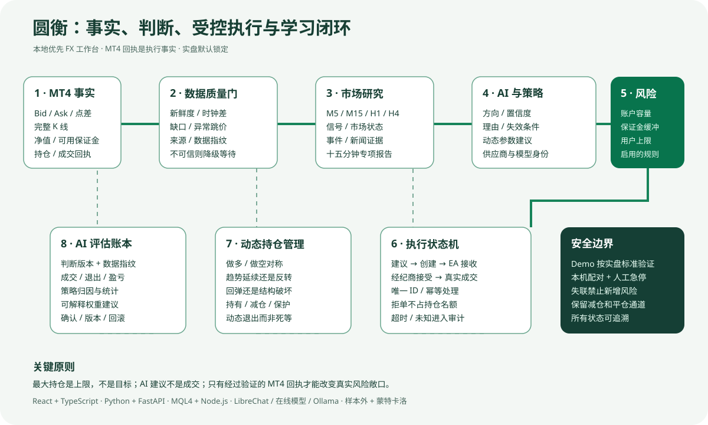
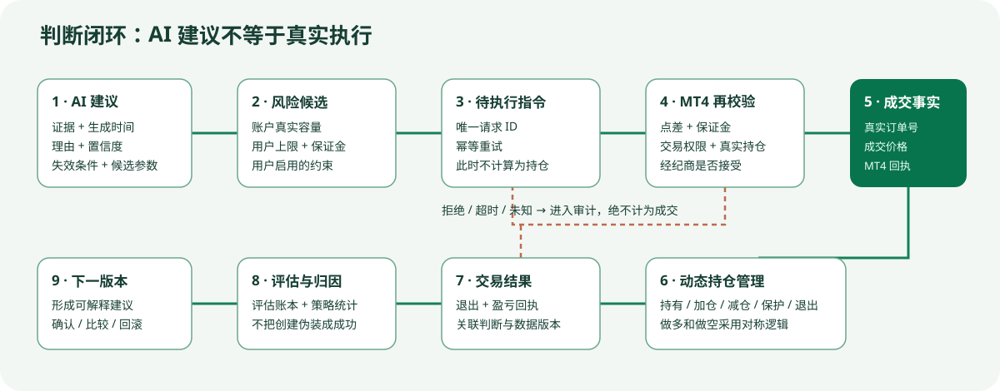

# 圆衡 Enkei FX

[日本語](./README.ja.md) | [English](./README.en.md) | [中文](./README.md)



圆衡是面向 Windows 与 MetaTrader 4 的本地优先外汇研究、AI 分析、策略验证和受控交易工作台。行情、审计记录和学习数据默认保存在用户自己的电脑中；外部通信仅发生在用户主动配置的模型服务和新闻来源之间。

> 当前版本是首个公开测试版。它不构成投资建议，不承诺收益。实盘交易默认锁定，启用前请先完成 Demo 验证并理解全部风险控制。

## 工作原理

1. MT4 EA 发布真实报价、历史 K 线、账户容量和成交回执。
2. 圆衡检查数据新鲜度、时间、缺口与来源，不合格的数据不能进入交易判断。
3. 本地策略与 AI 分析分别给出方向、置信度和理由，系统保存完整会话与数据指纹。
4. Demo 和实盘使用同一套判断、风险、审计与学习标准。
5. 订单只有在用户上限、账户资金容量、点差、止损和其他启用条件全部通过后才会提交 MT4。
6. MT4 的真实成交与退出回执进入评估账本，用于形成可解释、需确认、可回滚的权重建议。

## 主要能力

- 日本語、English、中文三语言界面，切换后整页使用同一种语言。
- MT4 实时报价、历史数据、Demo/实盘持仓和只读账户资金回传。
- 统一 AI 分析会话、真实模型身份、新闻/专项研究依据及 Token 用量记录。
- 固定策略库、样本外、滚动窗口、蒙特卡洛和前向验证。
- Demo 与受控实盘自动演练；默认最大持仓 2，用户可在硬上限内修改。
- AI 动态参数建议、用户确认、版本管理、比较和回滚。
- 计划事件、异常波动、十五分钟专项追踪与运营中心。
- 本机配对、急停、失联保护、保证金缓冲和完整执行审计。

## 核心设计逻辑

圆衡并不是“让大模型直接控制 MT4”的脚本。它把研究、判断、约束、执行和复盘拆成彼此可核验的层级：

- **事实层**：只接收带时间戳和来源的数据，包括 Bid/Ask、点差、已完成 K 线、账户净值、可用保证金、真实持仓和成交回执。
- **质量层**：检查行情新鲜度、服务器时钟差、K 线缺口、异常跳价和数据指纹。数据不可证实时，判断必须降级为等待。
- **研究层**：融合 M5/M15/H1/H4 多周期结构、技术特征、计划事件、新闻证据和市场专项报告，但新闻不能替代价格证据。
- **判断层**：固定策略与 AI 独立表达方向、市场状态、置信度、理由、失效条件和候选参数，保留实际供应商及模型身份。
- **风险层**：以账户真实容量、用户上限、保证金缓冲和已启用条件计算本次允许风险；“最大持仓”是上限，不是下单目标。
- **执行层**：指令创建、MT4 接收、经纪商接受、真实成交是四个不同状态。只有 MT4 回执后才计入持仓，拒单不会占用仓位。
- **持仓管理层**：对多单和空单对称处理；根据趋势延续、反转、回撤和浮盈状态决定持有、减仓、移动保护或退出，而不是只等待固定止盈止损。
- **评估层**：成交结果写入 AI 评估账本，与当时的数据指纹和判断版本关联，形成可解释、需确认、可回滚的后续建议。



## 技术体系

| 范围 | 实现与目的 |
|---|---|
| 工作台 | React、TypeScript、Vinext/Vite；三语界面、控制台、图表、运营中心与设置页 |
| AI 终端 | Python、FastAPI、Pydantic、HTTPX；模型路由、结构化输出校验、研究调度与审计 |
| MT4 桥接 | MQL4 EA + 本机 Node.js 服务；行情、历史、账户、指令及成交回执双向传递 |
| 模型路由 | 在线 OpenAI 兼容供应商、LibreChat Agents API、Ollama 本地模型；不可用状态明确展示 |
| 策略验证 | 样本内/样本外、滚动窗口、固定种子蒙特卡洛、前向验证和人工晋级 |
| 稳定性 | 后台常驻服务、页面与执行生命周期分离、重连、幂等指令、超时、熔断和失联保护 |
| 安全与隐私 | 回环地址、本机配置、实盘默认锁定、急停、最小权限、发布白名单和敏感内容扫描 |

## 从分析到成交的状态语义

`AI 建议` 不等于 `指令已创建`，`指令已创建` 不等于 `已成交`。圆衡以 MT4/经纪商回执为唯一执行事实：

1. AI 给出带依据、时间和失效条件的建议。
2. 风险引擎结合实时账户容量和用户参数生成候选指令。
3. 本机执行网关创建具有唯一 ID 的待执行请求。
4. MT4 EA 重新校验点差、保证金、持仓和交易权限。
5. 只有真实订单号和成交回执返回后，界面才显示“执行成功”并占用仓位。
6. 拒绝、超时或未知状态都会进入审计队列，不能伪装成成交。

## 快速安装

要求：64 位 Windows 10/11、MetaTrader 4。Node.js 22.13+ 与 Python 3.11+ 缺失时安装程序会尝试配置；使用本地 LibreChat 时还需要 Docker Desktop。

1. 下载发布压缩包，完整解压到较短路径，例如 `C:\Enkei`。
2. 双击 `Start-Enkei.cmd`；首次启动会安装依赖并打开 `http://127.0.0.1:3000`。
3. 在 MT4 选择“文件 → 打开数据文件夹”，把 `bridge` 中三个 `.mq4` 文件复制到 `MQL4\Experts`。
4. 按 `F4` 打开 MetaEditor，逐个编译并确认 `0 errors, 0 warnings`。
5. 刷新 MT4 导航器，先挂载只读行情 EA，再按需要挂载 Demo 或实盘执行 EA。
6. 在圆衡完成连接、数据校准和 Demo 验证；实盘不会自动开启。

完整安装、模型配置、升级和排错见[中文使用指南](./docs/guide.zh.md)。

## 模型连接

- 在线模型：在 AI 终端中选择供应商和模型，通过本机环境变量或设置页保存 API 密钥。密钥不会写入仓库。
- LibreChat：连接本机 LibreChat Agents API；普通网页聊天历史不会被冒充为圆衡分析记录。
- 本地模型：安装 Ollama、下载模型，再选择本地路由。
- 无模型可用时，系统会明确显示不可用或回退到本地规则，不会伪造 AI 结果。

## 安全边界

- 服务仅绑定本机回环地址，不应直接暴露到局域网或公网。
- 实盘默认锁定，需要账户确认、配对和 MT4 EA 手动授权。
- 急停不会自动解除；失联时禁止新增风险，但保留受控减仓和平仓能力。
- 密钥、账户、日志、历史行情、训练/学习数据、数据库和内部工作报告均不属于源码发布内容。

## 开发

```powershell
npm install
npm run ci
cd ai-terminal
.venv\Scripts\python.exe -B -m unittest discover -p "test_*.py"
```

贡献前请阅读 [CONTRIBUTING.md](./CONTRIBUTING.md)、[SECURITY.md](./SECURITY.md) 和[第三方声明](./THIRD_PARTY_NOTICES.md)。项目采用 [MIT License](./LICENSE)。
