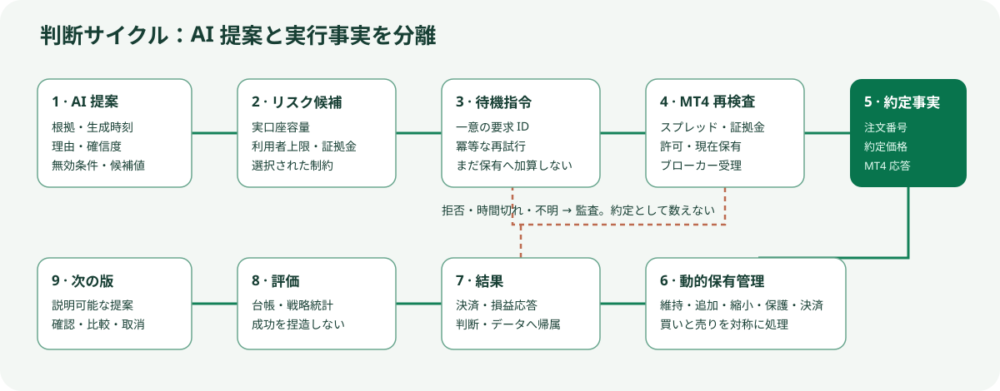

# 円衡 日本語利用ガイド

[ホーム](../README.ja.md) | [English](./guide.en.md) | [中文](./guide.zh.md)

## インストールと起動

リリースを `C:\Enkei` など短いパスへ完全に展開し、`Start-Enkei.cmd` を実行します。初回は Node.js、Python、依存関係、ローカルポートを確認します。`http://127.0.0.1:3000` が開いたら運用センターを確認します。更新時は既存フォルダを新しい `Update-Enkei.cmd` へドラッグするか、完全展開した新ファイルで置換します。

## MT4 EA の導入

MT4 → ファイル → データフォルダを開く → `MQL4\Experts` に、読取専用の `EnkeiQuotePublisher.mq4`、Demo 専用で既定無効の `EnkeiDemoExecutionGate.mq4`、実口座専用で既定ロックの `EnkeiLiveExecutionGate.mq4` をコピーします。`F4` で MetaEditor を開き、各ファイルを `F7` でコンパイルして `0 errors, 0 warnings` を確認します。ナビゲータを更新して再装着し、同じ実行 EA を複数チャートへ装着しないでください。

## AI の設定

オンラインモデルは正確な提供元とモデルを選び、キーを端末内の環境または設定だけに保存します。LibreChat は Docker Desktop とローカル LibreChat を起動して Agents API を選択します。通常の Web 会話は円衡記録と別です。Ollama は導入後にモデルを取得し、正確な名前を選択します。モデルが利用できない場合、円衡は失敗または規則への復帰を明示し、AI 出力を捏造しません。

## Demo 検証

レート EA を装着し、レート・履歴・時刻確認を通します。Demo EA を装着してパラメータ内で Demo 実行を手動許可します。Demo サービスの起動、ペアリング、起動保護解除、確認語入力を行います。最大保有数は既定 2、1～10 で利用者が変更可能です。これは AI の目標ではなく上限です。MT4 は各注文前に実際の純資産と余剰証拠金を確認し、純資産 20% の余力を保持します。送信指示は約定ではなく、MT4 実ポジションだけを数えます。

## 判断、学習、実取引

完全な判断は市場状態、時間足、時間帯、ニュース・研究、規則との一致、スプレッド・スリッページ、確信度、無効条件を記録します。AI パラメータは時刻と理由を表示し、確認または明示的な自動適用後だけ反映します。学習は実判断・実行・結果を使い、版管理とロールバックを備えます。実取引には Demo 完了、口座確認、ペアリング、実取引 EA の手動許可が必要です。緊急停止は自動解除されず、切断時は新規リスクを禁止して制御決済を残します。

## 問題解決とプライバシー

`terminal-unreachable` は AI 端末とポートを確認し制御センターを再起動します。履歴が古い場合は MT4 をオンラインにして対象時間足を取得します。EA は `.mq4` のコピー、コンパイル、ナビゲータ更新、再装着で更新します。拒否理由は実行監査を確認します。Issue 公開前に口座、サーバー、キー、個人パス、注文番号を削除し、`.env`、`ai-terminal/data`、DB、MT4 履歴 CSV、学習データ、実行ログをアップロードしないでください。
